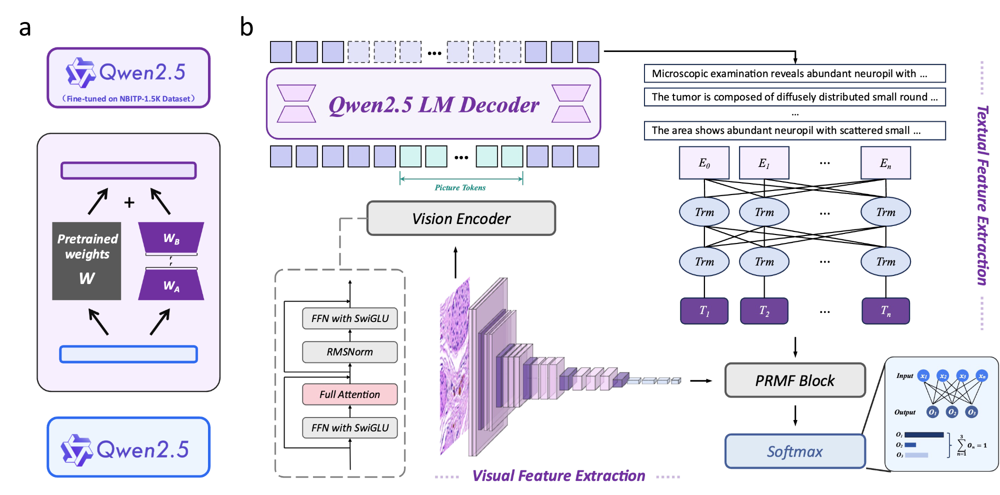

# MMLNB
The overall architecture of our proposed MMLNB model. The model consists of two stages: (a) fine-tuning a VLM via LoRA; (b) applying the fine-tuned VLM to generate pathology-aware textual descriptions to assist image classification.


## Installation

- Create a conda environment:

```bash
$ conda create -n mmlnb python=3.10
$ conda activate mmlnb
```

- Install required packages:

```bash
$ pip install -r requirements.txt
```

## Dataset

- Place the dataset in the main folder with the following folder structure:
```
data/
├── NBPath-7.5K/
│   ├── images/
└── NBITP-1.5K/
    ├── images/
    └── descriptions.csv
```

- The descriptions CSV files should contain the pathology descriptions and corresponding image file names (columns: file_name, description, class, where class values are PD, D, or UD).

## Training and Testing

### Fine-tune VLM
```bash
$ python train_VLM.py \
    --json_path path/to/finetune_dataset.json \
    --output_dir path/to/save/model \
    --project_name "Qwen2.5-VL-finetune" \
    --experiment_name "qwen2.5-vl-pathology" \
    --dataset "Neuroblastoma Pathology Gallery" \
    --prompt_path "src/configs/prompt.txt"
```

### Batch Inference
```bash
$ python src/VLM_batch_inference.py \
    --img_dir path/to/test/images \
    --output_path path/to/save/results.csv \
    --prompt_path configs/prompt.txt \
    --finetuned_model path/to/finetuned/model
```

### Train MMLNB
```bash
$ python train_MMLNB.py \
    --csv_path path/to/descriptions.csv \
    --image_dir path/to/image/directory \
    --save_checkpoint path/to/save/model.pth
```

## Citation

```
@misc{chen2025mmlnbmultimodallearningneuroblastoma,
      title={MMLNB: Multi-Modal Learning for Neuroblastoma Subtyping Classification Assisted with Textual Description Generation}, 
      author={Huangwei Chen and Yifei Chen and Zhenyu Yan and Mingyang Ding and Chenlei Li and Zhu Zhu and Feiwei Qin},
      year={2025},
      eprint={2503.12927},
      archivePrefix={arXiv},
      primaryClass={cs.CV},
      url={https://arxiv.org/abs/2503.12927}, 
}
```

